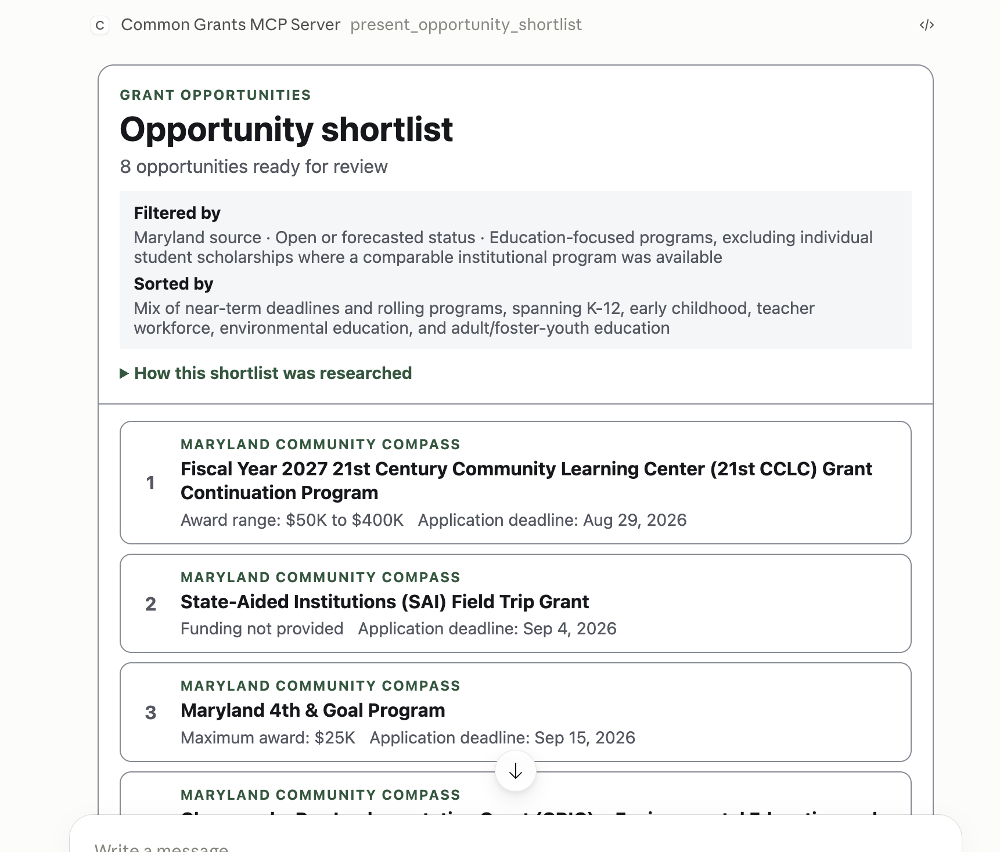

# CommonGrants MCP App

Find grant opportunities across federal and state funding sources by asking for
them in plain language, right inside Claude or ChatGPT.

<p align="center">
  
  <br />
  <em>The shortlist the assistant hands back after a few rounds of searching.</em>
</p>

<!-- TODO(#55): A recording of the app in use — type a search, get labeled
     cross-source results, open the shortlist, click into an opportunity's
     details — would show the flow better than this still.
     See docs/media/README.md for specs. -->

Instead of visiting each grant portal, running multiple searches, and manually
combining the results, you describe what you're looking for — _"find workforce
development grants closing in the next 90 days"_ — and the assistant searches
every source at once, then hands you a ranked shortlist you can click through.

## What's included

The app searches these funding sources:

| Source                           | What it covers                                        |
| -------------------------------- | ----------------------------------------------------- |
| **Simpler.Grants.gov**           | Federal grant opportunities from U.S. agencies        |
| **Pennsylvania**                 | State grant opportunities from the Commonwealth of PA |
| **California**                   | State grant opportunities from California             |
| **Washington — FundHub**         | State grant opportunities from Washington             |
| **Maryland — Community Compass** | State grant opportunities from Maryland               |

Results are always labeled with the source they came from, and every
opportunity links back to the grantmaker's own page so you can verify details
and apply.

For a normal shortlist, the assistant starts with a focused search and evaluates
whether the results provide enough relevant coverage. Five or more clearly
relevant candidates are ordinarily enough for a non-exhaustive shortlist. It
expands the search only when the results are insufficient, ambiguous, or clearly
incomplete, then hands the selected references to the presentation tool, which
loads their full details in parallel.

All of this data is public, so there's nothing to sign up for and no account to
connect — you add the app once and start searching.

## Quickstart

The app is hosted, so installing it means pointing your AI assistant at one URL:

```
https://mcp.cg.a6lab.ai/mcp
```

### Claude

<!-- TODO(#55): Replace with docs/media/install-claude.gif — Settings →
     Connectors → Add custom connector → paste URL → Add. -->

1. Open Claude in your browser or desktop app.
2. Go to **Settings → Connectors**.
3. Click **Add custom connector**.
4. Paste `https://mcp.cg.a6lab.ai/mcp` as the remote MCP server URL, give it a
   name like _CommonGrants_, and click **Add**.
5. Start a new chat and ask for grants. Claude will ask permission the first
   time it uses the app.

Anthropic's step-by-step guide, including the extra steps a Team or Enterprise
owner needs to take before members can add connectors:
[Get started with custom connectors using remote MCP](https://support.claude.com/en/articles/11175166-get-started-with-custom-connectors-using-remote-mcp).

### ChatGPT

<!-- TODO(#55): Replace with docs/media/install-chatgpt.gif — Settings →
     enable Developer mode → Plugins → + → paste URL → create. -->

ChatGPT calls these **apps**, and adding your own currently requires turning on
developer mode first:

1. In ChatGPT, go to **Settings → Security and login** and turn on
   **Developer mode**.
2. Go to **Settings → Plugins** and click **+**.
3. Paste `https://mcp.cg.a6lab.ai/mcp` as the server URL and create the app.
4. Start a new chat and ask for grants.

OpenAI's guide:
[Developer mode and MCP apps in ChatGPT](https://help.openai.com/en/articles/12584461-developer-mode-and-mcp-apps-in-chatgpt).

> On a ChatGPT Business or Enterprise workspace, a workspace admin publishes the
> app once (**Workspace Settings → Apps**) and everyone else finds it in their
> app list — individual members don't need developer mode.

### Other assistants

Any tool that supports remote MCP servers can use the same URL. See
[TECHNICAL.md](TECHNICAL.md) for running the app locally or connecting it to
other clients.

## Things to try

Once it's connected, ask your assistant things like:

- _"What federal grants are open for rural broadband?"_
- _"Find workforce development grants in Pennsylvania closing in the next 90 days."_
- _"Compare the eligibility requirements for the top three, and tell me which
  ones a small nonprofit could actually apply for."_
- _"Which of these have no cost-sharing requirement?"_

The assistant searches, narrows things down over a few turns, and then presents
a single shortlist you can review and expand.

## Roadmap

- **More data sources.** Any funder that publishes a
  [CommonGrants](https://commongrants.org)-compliant API can be added without
  changing the app, so the plan is to keep growing the list of participating
  states and federal programs.
- **Award data.** Today the app searches open _opportunities_. Adding historical
  award data would let you see who has been funded before, at what amounts, and
  by which programs — useful context for deciding whether an opportunity is
  worth pursuing.

Have a source you'd like to see added, or found something confusing? Please
[open an issue](https://github.com/agilesix/cg-mcp-grant-seeker/issues).

## Documentation

- **[TECHNICAL.md](TECHNICAL.md)** — how the app works: tools, source
  configuration, architecture, and hosting.
- **[DEVELOPMENT.md](DEVELOPMENT.md)** — running and deploying it yourself.
- **[CONTRIBUTING.md](CONTRIBUTING.md)** — how to contribute.

Licensed under [MIT](LICENSE).
